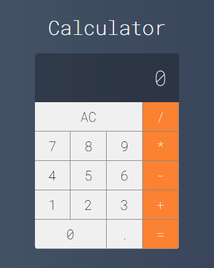

# 🧮 Calculadora

Esta é uma calculadora funcional desenvolvida com React, projetada para realizar operações matemáticas básicas como adição, subtração, multiplicação e divisão. O projeto tem como foco a simplicidade, responsividade e usabilidade, sendo uma excelente demonstração de componentes React e manipulação de eventos.

### 🔧 Funcionalidades

* Interface clara e responsiva, compatível com dispositivos móveis.
* Operações básicas: +, -, ×, ÷.
* Teclado numérico funcional.
* Botão "AC" para limpar os dados.

### 🛠️ Tecnologias Utilizadas

* [Vue](https://vuejs.org/)
* [JavaScript](https://www.w3schools.com/js/js_es6.asp)
* [HTML5](https:https://developer.mozilla.org/pt-BR/docs/Web/HTML)
* [CSS3](https://developer.mozilla.org/en-US/docs/Web/CSS)

## Dependências e Versões Necessárias

* Vue - Versão: 3.2.13

## Como rodar o projeto ✅

Para utiliza-lo basta:

1. Instalar as dependências
```
npm i
```

2. Depois, rode o seguinte comando para iniciar o servidor de desenvolvimento:
```
npm run serve
```

3. Acesse no navegador através da url: http://localhost:8080

